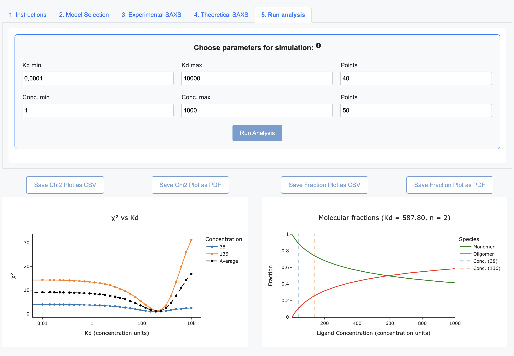
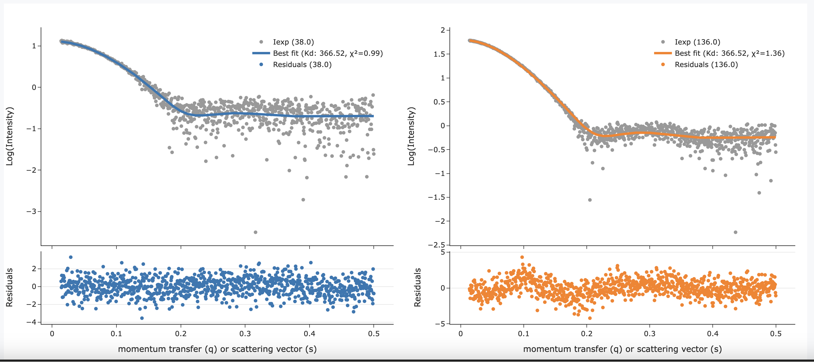

<p align="center">
  
</p>

<h1 align="center">K<sub>D</sub>SAXS: A tool to analyse binding equilibria with SAXS data using ensemble models</h1>

<p align="center">

</p>


## 💡 What is K<sub>D</sub>SAXS?

K<sub>D</sub>SAXS leverages SAXS titration data to calculate the dissociation constant (Kᴅ) for self-assembly and binding equilibria, providing information on oligomeric state distributions. With its intuitive interface, KᴅSAXS addresses the challenges of analyzing heterogeneous and dynamic systems, such as protein oligomerization, transient complexes and intrinsically disordered proteins. Dive in and unlock the full potential of your SAXS data with K<sub>D</sub>SAXS at [kdsaxs.itqb.unl.pt](https://kdsaxs.itqb.unl.pt/)

<!-- [1](#ref1) -->

## 🧰 How do I install locally K<sub>D</sub>SAXS?

1. ### Getting the repository
    -  Download this repository to your computer and execute in a terminal:

        ```
        cd KdSAXS
        pip install -r requirements.txt
        python app.py
        ```

    -  Or alternatively clone this repository:

   
          - Install Git if you haven't already:
            - On Ubuntu/Debian: `sudo apt-get install git`
            - On macOS: Install Xcode Command Line Tools or use Homebrew: `brew install git`

          - Clone the repository and install the requirements:

              ```
              git clone https://github.com/tiagolopesgomes/KdSAXS.git
              cd KdSAXS
              pip install -r requirements.txt
              python app.py
              ```
  

3. ### Install the ATSAS software 
    - Go to https://www.embl-hamburg.de/biosaxs/download.html, install the software, and set the ATSAS binaries directory in the `config.py` file.

2. ### Initializing K<sub>D</sub>SAXS
    - Open your web browser and go to http://127.0.0.1:8050/


## 💻 How can I use K<sub>D</sub>SAXS?
- Follow the instructions on the webapp.

- Choose between the two models, protein oligomerization and protein binding to fit your experimental data. 

- Upload your SAXS profiles, set parameters, and visualize results with interactive plots and downloadable CSV and PDF files.

- When you click on a Kd value in the χ² vs Kd plot the molecular fractions are displayed at the right side plot.

- The inputed concentrations, choosen parameters for the simulation and the uploaded experimental and theoretical SAXS profiles should be self-consistent in units.

- For more detailed information on input file formats and interpretation of results, please refer to the 'Detailed usage' section below.


    ## Detailed Usage

    <details>
    <summary>Click to expand</summary>

    ### Input File Formats

    #### Experimental SAXS Profiles
    - **File format**: Plain text (.dat or .txt)
    - **Columns**: 
      1. s (momentum transfer, Å^-1 or nm^-1 ) or q (scattering vector, Å^-1 or nm^-1)
      2. I(q) (scattering intensity, arbitrary units)
      3. σ(q) (experimental error)
    - **Example**:
      ```
      1.407443e-01   1.315394e+01   8.071628e-01
      1.458909e-01   1.257799e+01   7.595663e-01
      1.510375e-01   1.352606e+01   7.124305e-01
      ...
      ```
    

    #### Theoretical SAXS Profiles
    - **File format**: Plain text (.int or .txt)
    - **Columns**:
      1. s (momentum transfer, Å^-1 or nm^-1 ) or q (scattering vector, Å^-1 or nm^-1)
      2. I(q) (scattering intensity, arbitrary units)
    - **Example**:
      ```
      0.00e+00 6.30e+06
      5.00e-03 6.29e+06
      ...
      ```
    - **Note**: These should be generated from atomic structures using software like e.g. CRYSOL or FoXS

    ### Workflow for KdSAXS

    1. **Model Selection**
       - Choose between 'kds_saxs_mon_oligomer' (Monomer-Oligomer) and 'kds_saxs_oligomer_fitting' (Protein Binding)
       - Monomer-Oligomer: Analyzes equilibrium between monomers and a single oligomeric state
       - Protein Binding: Analyzes equilibrium between a receptor and multiple bound states of a ligand

    2. **Upload Experimental SAXS Profiles**
       - Upload one or more experimental SAXS profiles
       - Enter the concentration for each profile
       - The app supports multiple concentrations for a titration series.

    3. **Upload Theoretical SAXS Profiles**
       - Monomer-Oligomer: Upload two profiles (monomer and oligomer)
       - Protein Binding: Upload n+2 profiles, where n is the stoichiometry
         (e.g., for n=2: upload profiles for R, RL, R2L2, and L, where R and L are the free states for receptor and ligand respectively. R2L and R2L2 are one or two Ligand molecules bound to the Receptor dimer, respectively. For n=1 this model falls back to a simple 1:1 Receptor-Ligand binding)

    4. **Set Analysis Parameters**
       - Kd range: Set minimum and maximum Kd values and number of points
       - Concentration range: Set minimum and maximum concentrations and number of points
       - These ranges are used for simulating molecular fractions

    5. **Run Analysis**

       The app performs the following steps:
       - Calculates theoretical scattering for a range of Kd values and calculated molecular fractions.
       - Compares theoretical scattering to experimental data using χ² metric.
       - Determines best-fit Kd and molecular fractions.

    6. **View and Interpret Results**
       - χ² vs Kd plot: Shows goodness of fit across Kd range
         - Lower χ² indicates better fit
         - Multiple curves for different concentrations (if applicable)
       - Fraction plot: Shows molecular fractions vs concentration
         - Monomer-Oligomer: Monomer and oligomer fractions
         - Protein Binding: Fractions of each bound state and free ligand
       - SAXS fit plots: Shows best fit to experimental data
         - Upper panel: Log(Intensity) vs q or s
         - Lower panel: Residuals ((Iexp - Ifit) / σ)

    7. **Export Results**
       - Save plots as CSV or PDF files for further analysis or publication


    ### Important Considerations

    1. Concentration units must be consistent throughout (recommended: μM)
    2. Ensure theoretical profiles cover the same q-range as experimental data
    3. For accurate results, experimental concentrations should span the Kd range
    4. The app assumes a single Kd for all binding events in the Protein Binding model
    5. Oligomer stoichiometry (n) is assumed to be known and fixed during analysis

    ### Troubleshooting

    1. Ensure all required fields are filled before running analysis
    2. Verify that file formats match the specified requirements
    3. For Protein Binding model, confirm that the number of theoretical profiles matches n+2
        </details>


<!-- ## 🔎 How does KdSAXS work?
A general overview of KdSAXS, descriptions of employed methods and applications can be found in the KdSAXS paper:

    PAPER -->


# 🗨️ Citation and Publications

If you use KdSAXS, please cite its original publication:

    PUB


# 🤝 Acknowledgements

We thank the IT service of ITQB NOVA (www.itqb.unl.pt) for assistance with the web server setup and Nuno P. Fernandes for his valuable suggestions and role as a tester.


<!-- # 📖 References

example

<a id="ref1">[1]</a> J. Jumper, R. Evans, A. Pritzel et al., "Highly accurate protein structure prediction with AlphaFold," *Nature*, vol. 596, pp. 583–589, 2021. [[Link](https://doi.org/10.1038/s41586-021-03819-2)] -->


# ✍️ Authors

Tiago Lopes Gomes ([GitHub](https://github.com/tiagolopesgomes))
