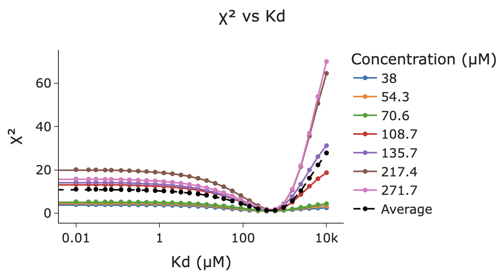
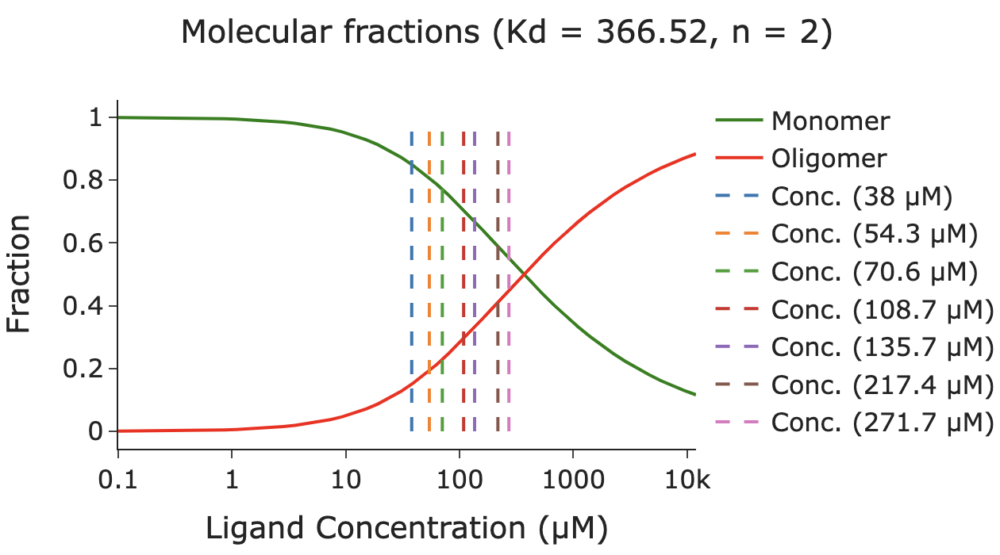

## Loading example data

Go to blg folder and upload the files below for the Beta-lactoglobulin at pH 8.

### Experimental SAXS data

Blac_1_16_Blac_1_subtraction_0.7_mgml_sample_Blac_1_160000-integrate_subtracted_gunier.dat @ 38 uM

Blac_1_15_Blac_1_subtraction_1.0_mgml_sample_Blac_1_150000-integrate_subtracted_gunier.dat @ 52,3 uM

Blac_1_14_Blac_1_subtraction_1.3_mgml_sample_Blac_1_140000-integrate_subtracted_gunier.dat @ 70,6 uM

Blac_1_12_Blac_1_subtraction_2.0_mgml_sample_Blac_1_120000-integrate_subtracted_gunier.dat @ 108,7 uM

Blac_1_11_Blac_1_subtraction_2.5_mgml_sample_Blac_1_110000-integrate_subtracted_gunier.dat @ 136 uM

Blac_1_9_Blac_1_subtraction_4.0_mgml_sample_Blac_1_90000-integrate_subtracted_gunier.dat @ 217,4 uM

Blac_1_8_Blac_1_subtraction_5.0_mgml_sample_Blac_1_80000-integrate_subtracted_gunier.dat @ 271,7 uM

### Theoretical SAXS data

avg_mon_ph8.int (upload in the first upload field)

avg_dim_ph8.int (upload in the second upload field)

### Expected χ² vs KD plot

