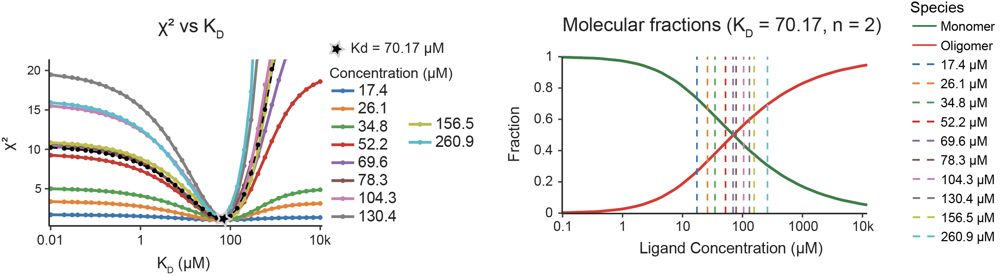

## Loading example data

Go to blg folder and upload the files below for the Beta-lactoglobulin at pH 7.

### Experimental SAXS data 

0.32_mgml_cut_28.dat @ 17.4 µM

0.48_mgml_cut_28.dat @ 26.1 µM

0.64_mgml_cut_28.dat @ 34.8 µM

0.96_mgml_cut_28.dat @ 52.2 µM

1.28_mgml_cut_28.dat @ 69.6 µM

1.44_mgml_cut_28.dat @ 78.3 µM

1.92_mgml_cut_28.dat @ 104.3 µM

2.4_mgml_cut_28.dat @ 130.4 µM

2.88_mgml_cut_28.dat @ 156.5 µM

4.8_mgml_cut_28.dat @ 260.9 µM

### Theoretical SAXS data

avg_mon_ph8.int (upload in the first upload field)
avg_dim_ph8.int (upload in the second upload field)

### Expected χ² vs KD plot

